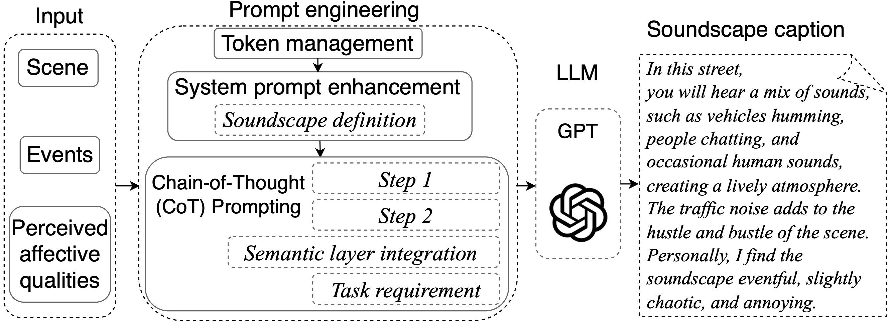

# Automatic soundscape captioner (SoundSCaper): Soundscape Captioning using Sound Affective Quality Network and Large Language Model

Paper link: https://arxiv.org/abs/2406.05914

ResearchGate: [SoundSCaper](https://www.researchgate.net/publication/381307435_Soundscape_Captioning_using_Sound_Affective_Quality_Network_and_Large_Language_Model)

-------

- [SoundSCaper](#automatic-soundscape-captioner--soundscaper---soundscape-captioning-using-sound-affective-quality-network-and-large-language-model)
  * [Introduction](#introduction)
    + [0. SounAQnet training steps (Optional)](#0-sounaqnet-training-steps-optional)
	+ [1. Use SoundAQnet to infer soundscape audio clips for LLMs](#1-use-soundaqnet-to-infer-soundscape-audio-clips-for-llms)
	+ [2. Generate soundscape captions using generic LLM](#2-generate-soundscape-captions-using-generic-llm)
    + [3. Expert evaluation of soundscape caption quality](#3-expert-evaluation-of-soundscape-caption-quality) 
    + [4. Other models](#4-other-models)
  * [Figure](#figure)
    + [1. Overall framework of the automatic soundscape captioner (SoundSCaper)](#1-overall-framework-of-the-automatic-soundscape-captioner-soundscaper)
    + [2. The acoustic model SoundAQnet simultaneously models acoustic scene (AS), audio event (AE), and emotion-related affective quality (AQ)](#2-the-acoustic-model-soundaqnet-simultaneously-models-acoustic-scene-as-audio-event-ae-and-emotion-related-affective-quality-aq)
    + [3. Process of the LLM part in the SoundSCaper](#3-process-of-the-llm-part-in-the-soundscaper)
	+ [4. Spearman's rho correlation between different AQs and AEs predicted by SoundAQnet](#4-spearmans-rho-correlation-r-between-different-ars-and-aes-predicted-by-soundaqnet)
	+ [5. Spearman's rho correlation between different AEs and 8D AQs predicted by SoundAQnet](#5-spearmans-rho-correlation-r-between-different-aes-and-8d-aqs-predicted-by-soundaqnet)
  * [Run Sound-AQ models to predict the acoustic scene, audio event, and human-perceived affective qualities](#run-sound-aq-models-to-predict-the-acoustic-scene-audio-event-and-human-perceived-affective-qualities)
    + [1. AD_CNN](#1-ad_cnn)
    + [2. Baseline CNN](#2-baseline-cnn)
    + [3. Hierachical CNN](#3-hierachical-cnn)
    + [4. MobileNetV2](#4-mobilenetv2)
    + [5. YAMNet](#5-yamnet)
    + [6. CNN-Transformer](#6-cnn-transformer)
    + [7. PANNs](#7-panns)
    + [8. SoundAQnet](#8-soundaqnet)
  * [More supplementary experiments' codes and results]()
	+ [1. SoundAQnet with different kernel combinations](SoundAQnet_different_kernels)
    + [2. SoundAQnet with different numbers of convolution layers ](SoundAQnet_blocks)
    + [3. SoundAQnet with different dilation rates](SoundAQnet_dilation_rates)
    + [4. SoundAQnet with multi-loss weighting](SoundAQnet_multi_loss_weighting)
<br>

## Introduction

### 0. SounAQnet training steps (Optional)

1\) Dataset preparation

- Download and place the ARAUS dataset ([ARAUS_repository](https://github.com/ntudsp/araus-dataset-baseline-models/tree/main)) into the [Dataset_all_ARAUS](Dataset_all_ARAUS) directory or the [Dataset_training_validation_test](Dataset_training_validation_test) directory (recommended)

- Follow the ARAUS steps ([ARAUS_repository](https://github.com/ntudsp/araus-dataset-baseline-models/tree/main)) to generate the raw audio dataset. The dataset is about 53 GB, please reserve enough space when preparing the dataset. (If it is in WAV, it may be about 134 GB.)

- Split the raw audio dataset according to the training, validation, and test audio file IDs in the [Dataset_training_validation_test](Dataset_training_validation_test) directory.

The labels of our annotated acoustic scenes and audio events, for the audio clips in the ARAUS dataset, are placed in the [Dataset_all_ARAUS](Dataset_all_ARAUS) directory and the [Dataset_training_validation_test](Dataset_training_validation_test) directory.

2) Acoustic feature extraction

- Log Mel spectrogram 
Use the code in [Feature_log_mel](Feature_log_mel) to extract log mel features.
	- Place the dataset into the `Dataset` folder.
	- If the audio file is not in `.wav` format, please run the `convert_flac_to_wav.py` first. (This may generate ~132 GB of data as WAV files.)
	- Run `log_mel_spectrogram.py`
 
- Loudness features (ISO 532-1)
 Use the code in [Feature_loudness_ISO532_1](Feature_loudness_ISO532_1) to extract the ISO 532-1:2017 standard loudness features.
	- Download the *ISO_532-1.exe* file, (which has already been placed in the folder `ISO_532_bin`).
	-Please place the audio clip files in `.wav` format to be processed into the `Dataset_wav` folder
	-If the audio file is not in `.wav` format, please use the `convert_flac_to_wav.py` to convert it. (This may generate ~132 GB of data as WAV files.)
	-Run `ISO_loudness.py`

3\) Training SoundAQnet
- Prepare the training, validation, and test sets according to the corresponding files in the [Dataset_training_validation_test](Dataset_training_validation_test) directory
- Modify the `DataGenerator_Mel_loudness_graph` function to load the dataset
- Run `Training.py` in the `application` directory

-------------

### 1. Use SoundAQnet to infer soundscape audio clips for LLMs

This part [Inferring_soundscape_clips_for_LLM](Inferring_soundscape_clips_for_LLM) aims to convert the soundscape audio clips into the predicted audio event probabilities, the acoustic scene labels, and the ISOP, ISOE, and emotion-related PAQ values.

This part bridges the acoustic model and the language model, organising the output of the acoustic model in preparation for the input of the language model.

1\) Data preparation

- Place the log Mel features files from the `Feature_log_mel` directory into the `Dataset_mel` directory

- Place the ISO 532-1 loudness feature files from the `Feature_loudness_ISO532_1` directory into the `Dataset_wav_loudness` directory


2\) Run the inference script

- cd `application`, python `Inference_for_LLM.py`

- The results, which will be fed into the LLM, will be automatically saved into the corresponding directories: `SoundAQnet_event_probability`, `SoundAQnet_scene_ISOPl_ISOEv_PAQ8DAQs`

- There are four similar SoundAQnet models in the `system/model` directory; please feel free to use them
	- SoundAQnet_ASC96_AEC94_PAQ1027.pth
	- SoundAQnet_ASC96_AEC94_PAQ1039.pth
	- SoundAQnet_ASC96_AEC94_PAQ1041.pth
	- SoundAQnet_ASC96_AEC95_PAQ1052.pth

3\) Inference with other models

This part [Inferring_soundscape_clips_for_LLM](Inferring_soundscape_clips_for_LLM) uses SoundAQnet to infer the values of audio events, acoustic scenes, and emotion-related AQs. 

If you want to replace SoundAQnet with another model to generate the soundscape captions, 
- replace `using_model = SoundAQnet` in `Inference_for_LLM.py` with the code for that model, 
- and place the corresponding trained model into the `system/model` directory.

4\) Demonstration

Please see details [here](Inferring_soundscape_clips_for_LLM#4-demonstration).

-------------


### 2. Generate soundscape captions using generic LLM

This part, [LLM_scripts_for_generating_soundscape_caption](LLM_scripts_for_generating_soundscape_caption), loads the acoustic scene, audio events, and PAQ 8-dimensional affective quality values corresponding to the soundscape audio clip predicted by SoundAQnet, and then outputs the corresponding soundscape descriptions. <br> Please fill in your OpenAI username and password in [LLM_GPT_soundscape_caption.py](LLM_scripts_for_generating_soundscape_caption/LLM_GPT_soundscape_caption.py).

1\) Data preparation

- Place the matrix file of audio event probabilities predicted by the SoundAQnet into the `SoundAQnet_event_probability` directory

- Place the SoundAQnet prediction file, including the predicted acoustic scene label, ISOP value, ISOE value, and the 8D AQ values, into the `SoundAQnet_scene_ISOPl_ISOEv_PAQ8DAQs` directory

2\) Generate soundscape caption

- Replace the "YOUR_API_KEY_HERE" in line 26 of the `LLM_GPT_soundscape_caption.py` file with your OpenAI API key

- Run `LLM_GPT_soundscape_caption.py`

3\) Demonstration

Please see details [here](LLM_scripts_for_generating_soundscape_caption#3-demonstration).

-------------
 

### 3. Expert evaluation of soundscape caption quality

[Human_assessment](Human_assessment) contains 

1) a call for experiment

2) [assessment raw materials](Human_assessment/Assessment_materials) 
- [assessment audio dataset](Human_assessment/Assessment_materials/final_60)
- participant instruction file
- local and online questionnaires 

3) [Expert assessment results analysis](Human_assessment/Expert_assessment_results_analysis) 

Here are the assessment statistical results from a jury composed of 16 audio/soundscape experts.

There are two sheets in the file `SoundSCaper_expert_evaluation_results.xlsx`. 

- Sheet 1 is the statistical results of 16 human experts and SoundSCaper on the evaluation dataset D1 from the test set.

- Sheet 2 is the statistical results of 16 human experts and SoundSCaper on the model-unseen mixed external dataset D2, which has 30 samples randomly selected from 5 external audio scene datasets with varying lengths and acoustic properties.

-------------

### 4. Other models
  
The trained models of the other 7 models in the paper have been attached to their respective folders. 

- If you want to train them yourself, please follow the SounAQnet training steps.

- If you want to test or evaluate these models, please run the model inference [here](#run-models).

-------------
<br>

## Figure

### 1. The 8-dimensional (8D) affective qualities (AQs) in the soundscape circumplex model (SCM) recommended by ISO/TS 12913-3:2019. 
<h3 align="center"> <p></p></h3>
<div align="center">
 
</div>  

-------------

### 2. Results of tasks on the same audio clip: coloured texts show differences between audio captioning and soundscape captioning. Blue texts indicate human-perceived AQ-related descriptions unique to soundscape captioning.
<h3 align="center"> <p></p></h3>
<div align="center">
 
</div>  

-------------

### 3. Overall framework of the automatic soundscape captioner (SoundSCaper)

<h3 align="center"> <p></p></h3>
<div align="center">
 
</div>  

-------------

### 4. The acoustic model SoundAQnet simultaneously models acoustic scene (AS), audio event (AE), and emotion-related affective quality (AQ)

<h3 align="center"> <p></p></h3>
<div align="center">
 
</div> 

-------------

### 5. Process of the LLM part in the SoundSCaper
<h3 align="center"> <p></p></h3>
<div align="center">
 
</div> 

For full prompts and the LLM script, please see [here](LLM_scripts/SoundSCaper_LLM.py).

-------------

### 6. Spearman’s rho correlation coefficients of AE and AQ. *, **, and *** denote statistical significance at the 0.05, 0.01, and 0.001 levels, respectively.
<h3 align="center"> <p></p></h3>
<div align="center">
 
</div>  

-------------


### 7. Spearman's rho correlation ($r$) between different AQs and AEs predicted by SoundAQnet
<h3 align="center"> <p></p></h3>
<div align="center">
 
</div> 


For all 8D AQ results, please see [here](Figure/PAQ8AQs.png).

-------------

### 8. Spearman's rho correlation ($r$) between different AEs and 8D AQs predicted by SoundAQnet
<h3 align="center"> <p></p></h3>
<div align="center">
 
</div> 

For all 15 AE results, please see [here](Figure/event15.png).

-------------

### 9. The radar plot of SoundAQnet’s predictions for scenes
<h3 align="center"> <p></p></h3>
<div align="center">
 
 
 
 
</div>  
  

-------------

### 10. The scatter plot and density distribution curves for SoundAQnet’s predictions for scenes
<h3 align="center"> <p></p></h3>
<div align="center">
 
 
 
 
</div>

-------------

### 11. The scatter plot, density distribution curves, and marginal distributions for the 3 scenes involved are from SoundAQnet’s predictions
<h3 align="center"> <p></p></h3>
<div align="center">
 
</div>  

-------------


<br>


## Run Sound-AQ models to predict the acoustic scene, audio event, and human-perceived affective qualities 

Please download the testing set (about 3 GB) from [here](https://drive.google.com/file/d/1Rzse5NfbNKyT3mNgcz-y1GUueAnjlOR1/view?usp=sharing), and place it under the Dataset folder.
 
 

### 1. AD_CNN

```python 
cd Other_AD_CNN/application/
python inference.py
-----------------------------------------------------------------------------------------------------------
Number of 3576 audios in testing
Parameters num: 0.521472 M 
ASC	Acc:  89.30 %
AEC	AUC:  0.84
PAQ_8D_AQ	MSE MEAN: 1.137
pleasant_mse: 0.995 eventful_mse: 1.174 chaotic_mse: 1.155 vibrant_mse: 1.135
uneventful_mse: 1.184 calm_mse: 1.048 annoying_mse: 1.200 monotonous_mse: 1.205
``` 

### 2. Baseline CNN

```python 
cd Other_Baseline_CNN/application/
python inference.py
-----------------------------------------------------------------------------------------------------------
ASC	Acc:  88.37 %
AEC	AUC:  0.92
PAQ_8D_AQ	MSE MEAN: 1.250
pleasant_mse: 1.030 eventful_mse: 1.233 chaotic_mse: 1.452 vibrant_mse: 1.074
uneventful_mse: 1.254 calm_mse: 1.095 annoying_mse: 1.637 monotonous_mse: 1.222
``` 

### 3. Hierachical CNN

```python 
cd Other_Hierarchical_CNN/application/
python inference.py
-----------------------------------------------------------------------------------------------------------
Parameters num: 1.009633 M
ASC	Acc:  90.68 %
AEC	AUC:  0.88
PAQ_8D_AQ	MSE MEAN: 1.240
pleasant_mse: 0.993 eventful_mse: 1.518 chaotic_mse: 1.259 vibrant_mse: 1.162
uneventful_mse: 1.214 calm_mse: 1.251 annoying_mse: 1.349 monotonous_mse: 1.171
``` 

### 4. MobileNetV2

```python 
cd Other_MobileNetV2/application/
python inference.py
-----------------------------------------------------------------------------------------------------------
Parameters num: 2.259164 M
ASC	Acc:  88.79 %
AEC	AUC:  0.92
PAQ_8D_AQ	MSE MEAN: 1.139
pleasant_mse: 0.996 eventful_mse: 1.120 chaotic_mse: 1.179 vibrant_mse: 1.011
uneventful_mse: 1.273 calm_mse: 1.148 annoying_mse: 1.183 monotonous_mse: 1.199
``` 

### 5. YAMNet

```python 
cd Other_YAMNet/application/
python inference.py
-----------------------------------------------------------------------------------------------------------
Parameters num: 3.2351 M
ASC	Acc:  89.17 %
AEC	AUC:  0.91
PAQ_8D_AQ	MSE MEAN: 1.197
pleasant_mse: 1.013 eventful_mse: 1.265 chaotic_mse: 1.168 vibrant_mse: 1.103
uneventful_mse: 1.404 calm_mse: 1.125 annoying_mse: 1.220 monotonous_mse: 1.277
``` 

### 6. CNN-Transformer

```python 
cd Other_CNN_Transformer/application/
python inference.py
-----------------------------------------------------------------------------------------------------------
Parameters num: 12.293996 M
ASC	Acc:  93.10 %
AEC	AUC:  0.93
PAQ_8D_AQ	MSE MEAN: 1.318
pleasant_mse: 1.112 eventful_mse: 1.333 chaotic_mse: 1.324 vibrant_mse: 1.204
uneventful_mse: 1.497 calm_mse: 1.234 annoying_mse: 1.365 monotonous_mse: 1.478
``` 

### 7. PANNs

* Please download the trained model [PANNs_AS_AE_AQ](https://drive.google.com/file/d/1WH7BiY8p7-HFJZWkSLSrLgmqvM3d7usN/view?usp=sharing) ~304MB 
* unzip it 
* put the model `PANNs_AS_AE_AQ.pth` under the `Other_PANNs\application\system\model` 

```python  
cd Other_PANNs/application/
python inference.py
-----------------------------------------------------------------------------------------------------------
Parameters num: 79.731036 M
ASC	Acc:  93.28 %
AEC	AUC:  0.89
PAQ_8D_AQ	MSE MEAN: 1.139
pleasant_mse: 1.080 eventful_mse: 1.097 chaotic_mse: 1.110 vibrant_mse: 1.087
uneventful_mse: 1.267 calm_mse: 1.160 annoying_mse: 1.086 monotonous_mse: 1.227
``` 
 
### 8. SoundAQnet

```python 
cd SoundAQnet/application/
python inference.py
-----------------------------------------------------------------------------------------------------------
Parameters num: 2.701812 M
ASC	Acc:  96.09 %
AEC	AUC:  0.94
PAQ_8D_AQ	MSE MEAN: 1.027
pleasant_mse: 0.880 eventful_mse: 1.029 chaotic_mse: 1.043 vibrant_mse: 0.972
uneventful_mse: 1.126 calm_mse: 0.969 annoying_mse: 1.055 monotonous_mse: 1.140
``` 


